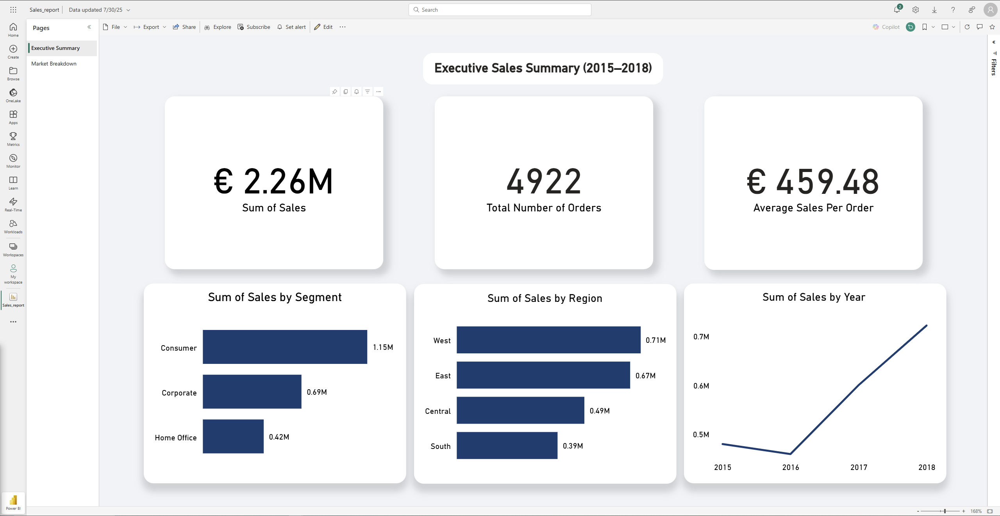
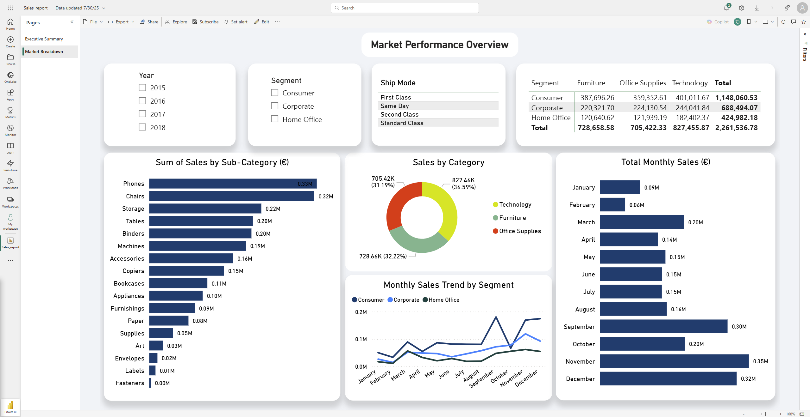

# 📊 Power BI Sales Performance Dashboard Project

This project explores a retail sales dataset through end-to-end data analysis, transformation, and visualization. The goal was to extract actionable business insights and present them in an interactive Power BI dashboard suitable for both technical and non-technical stakeholders.

---

## 🧠 Project Summary

I used **Databricks** to clean and analyze raw sales data through SQL and Python. After transforming the dataset, I exported it to **Power BI** to create a dynamic and professional dashboard with multiple pages, including:

- Executive Sales Summary
- Market Performance Overview

The final dashboard was published on **Power BI Service (My Workspace)**, making it accessible online.

---

## 📌 Reports

### 📘 1. Technical Report (Exploratory & Power BI Process)
This report details:
- Data cleaning and exploration steps in Databricks
- Data export process to Power BI
- Dashboard design decisions
- Visual summaries and data interpretation

➡️ [View Technical Report (PDF)](PowerBI_Reports/Technical_report.pdf)

---

### 📗 2. Business/Marketing Report (Insights & Recommendations)
A business-focused report designed for decision-makers. It includes:
- Key insights by region, segment, and product
- Marketing takeaways and growth recommendations
- Suggested next steps for commercial strategy

➡️ [View Business/Marketing Report (PDF)](PowerBI_Reports/Marketing_report.pdf)

---

📽️ Interactive Dashboard Demo
Watch a short video demonstration of the dashboard's interactive features:

## 🖼️ Dashboard Previews

### Executive Summary  

### Market Performance Overview  

---

## 🧰 Tools & Skills Used

- **Python** (Data cleaning, EDA in Databricks)
- **SQL** (Aggregations, filtering)
- **Databricks** (Notebooks, tables, interactive queries)
- **Power BI** (Visual dashboards, DAX, slicers, cards, bar charts)
- **GitHub** (Version control & documentation)

---

## 📁 Files in This Repo

| File/Folder | Description |
|-------------|-------------|
| `Databricks_Notebooks/` | Data exploration and cleaning in `.ipynb` format |
| `PowerBI_Reports/` | PDF reports (technical and business/marketing) |
| `PowerBI_Dashboard_Screenshots/` | Visual snapshots from Power BI dashboard |
| `Sales_report.pbix` | Original Power BI dashboard file |

---

## 🔗 Live Dashboard (Optional)

If published publicly, insert your Power BI dashboard link here:

➡️ [View Live Dashboard](https://app.powerbi.com/...)

---

## 📬 Contact

Created by **Treva Antony Ogwang**  
📍 Potsdam/Berlin, Germany  
🔗 [LinkedIn](https://www.linkedin.com/in/treva-ogwang-87235626b/)  
📁 [GitHub Portfolio](https://github.com/Begge10850)

---

